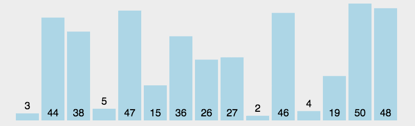

## 整数排序

给一组整数，按照升序排序，使用选择排序，冒泡排序，插入排序或者任何 O(n2) 的排序算法

## 1. 简单选择排序

1. 从未排序序列中，找到关键字最小的元素所在的索引；
2. 将最小元素与未排序序列中的第一个元素互换位置
3. 重复步骤1，2



```java
package com.leetcode;

import java.util.Arrays;

/**
 * @author melody
 */
public class Solution {
    /**
     * @param a: an integer array
     * @return: nothing
     */
    public void sortIntegers(int[] a) {
        // 简单选择排序
        int length = a.length;

        for (int i = 0; i < length; i++){
            int min = i;
            // 往后找出最小的元素下标
            for (int j = i + 1 ; j < length ; j++){
                if(a[min] > a[j]){
                    min = j;
                }
            }
            // 交换元素
            if(min != i){
                int temp = a[i];
                a[i] = a[min];
                a[min] = temp;
            }
        }
    }
}
```


## 2. 冒泡排序

1. 比较相邻的元素，如果第一个比第二个大，则交换他们
2. 对每一对相邻的元素做同样的操作，从开始的第一对到结尾的最后一对，这步做完后，最后的元素将会时最大的数
3. 针对所有的元素重复以上的动作，除了最后一个
4. 持续每次对越来越少的元素重复上面的步骤，直到没有任何一对数字需要比较


```java
public class Solution {
    public void sortIntegers(int[] a) {
        // 冒泡排序
        int length = a.length;
        // 外层循环控制比较次数
        for(int i = 0 ; i < length ; i++){
            // 从后往前一直比较，将最小的数冒到最前面
            for (int j = length -1 ; j > i ; j-- ){
                if(a[j] < a[j -1]){
                    int temp = a[j];
                    a[j] = a[j -1 ];
                    a[j-1] = temp;
                }
            }
        }
    }
}
```

时间复杂度：O(n<sup>2</sup>)

## 3. 归并排序

## 4. 直接插入排序

1. 从第一个元素开始，该元素可以认为已经被排序
2. 取出下一个元素，在已经排序的元素序列中从后向前扫描
3. 如果该元素（已排序）大于新元素，将该元素移到下一个位置
4. 重复步骤3，查找已排序的元素小于或者等于新元素的位置
5. 将新元素插入到该位置后
6. 重复步骤2-5


```java
public class Solution {
    public void sortIntegers(int[] a) {
        // 直接插入排序,从当前选中的位置一个个往前比较
        int length = a.length;
        for (int i = 1; i < length; i++) {
            int temp = a[i];
            while (i > 0 && temp < a[i - 1]) {
                a[i] = a[i - 1];
                i--;
            }
            a[i] = temp;
        }
    }
}
```

> 时间复杂度：O(n<sup>2</sup>)

## 5. 快速排序

## 6. 希尔排序

## 7. 堆排序

## 8. 基数排序


选择排序，冒泡排序，插入排序